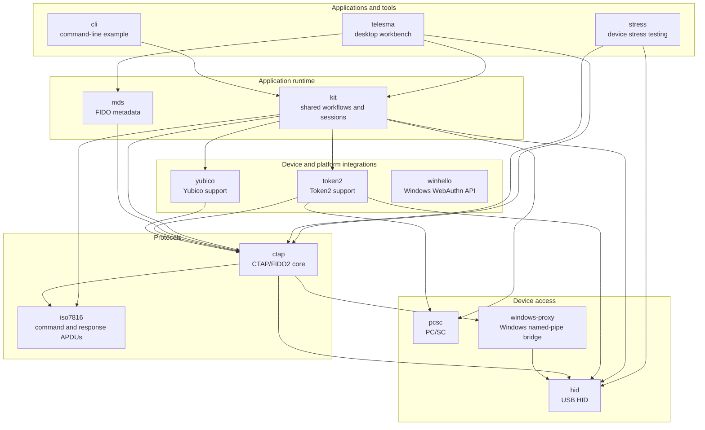

  

# Telesma

Telesma is an open-source workbench and Go toolkit for inspecting, managing,
testing, and integrating local FIDO2 authenticators. The project covers CTAP
2.0–2.3, CTAPHID, ISO/IEC 7816-4, PC/SC, the Windows WebAuthn API, and the FIDO
Metadata Service.

## Projects

| Area | Repository | What it provides |
|---|---|---|
| Application | [`telesma`](https://github.com/telesma-app/telesma) | Wails 3 desktop workbench for inspecting and managing local FIDO2/CTAP authenticators. |
| Tools | [`cli`](https://github.com/telesma-app/cli) | Command-line example for building CTAP/FIDO2 tooling on the shared runtime. |
| Tools | [`stress`](https://github.com/telesma-app/stress) | Read-only USB CTAP2 stress testing with latency, throughput, and error reports. |
| Runtime | [`kit`](https://github.com/telesma-app/kit) | Reusable discovery, session, operation, interaction, and safety workflows for authenticator applications. |
| Runtime | [`mds`](https://github.com/telesma-app/mds) | Client for downloading and verifying FIDO Metadata Service (MDS3) data. |
| Protocols | [`ctap`](https://github.com/telesma-app/ctap) | Core CTAP 2.0–2.3 commands and stateful authenticator workflows. |
| Protocols | [`iso7816`](https://github.com/telesma-app/iso7816) | Transport-independent ISO/IEC 7816-4 command and response APDUs. |
| Integrations | [`token2`](https://github.com/telesma-app/token2) | Token2 device support over PC/SC, USB HID feature reports, and CTAPHID. |
| Integrations | [`yubico`](https://github.com/telesma-app/yubico) | Yubico-specific device information and identity support. |
| Integrations | [`winhello`](https://github.com/telesma-app/winhello) | cgo-free Go bindings for the Windows WebAuthn API and Windows Hello. |
| Device access | [`hid`](https://github.com/telesma-app/hid) | Cross-platform, cgo-free access to HID devices. |
| Device access | [`pcsc`](https://github.com/telesma-app/pcsc) | Minimal, cgo-free PC/SC access for smart cards and security tokens. |
| Device access | [`windows-proxy`](https://github.com/telesma-app/windows-proxy) | Windows service and named-pipe bridge for FIDO2 HID access without elevated application rights. |

## Project map

Arrows point from each consumer to its direct in-organization dependencies.

