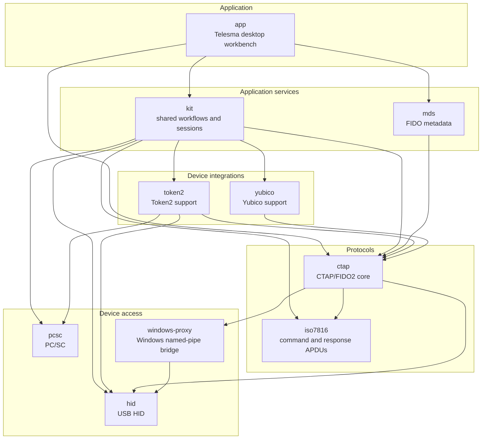

# go-ctap

Go libraries and runtime components for working with FIDO2, CTAP, CTAPHID and platform WebAuthn APIs.

## Repositories

| Repository                                                    | Summary                                                                                                       |
|---------------------------------------------------------------|---------------------------------------------------------------------------------------------------------------|
| [`app`](https://github.com/go-ctap/app)                       | Telesma, a Wails desktop workbench for inspecting and managing local FIDO2/CTAP authenticators.               |
| [`kit`](https://github.com/go-ctap/kit)                       | Shared application runtime for discovery, sessions, operations, interaction prompts, and safety checks.      |
| [`mds`](https://github.com/go-ctap/mds)                       | Client for downloading and verifying FIDO Metadata Service (MDS3) data.                                      |
| [`ctap`](https://github.com/go-ctap/ctap)                     | Core CTAP 2.0–2.3 implementation and stateful authenticator workflows.                                       |
| [`token2`](https://github.com/go-ctap/token2)                 | Token2 device support over PC/SC, USB HID feature reports, and CTAPHID.                                      |
| [`yubico`](https://github.com/go-ctap/yubico)                 | Yubico-specific device information and identity support.                                                     |
| [`iso7816`](https://github.com/go-ctap/iso7816)               | Transport-independent ISO/IEC 7816-4 command and response APDUs.                                             |
| [`hid`](https://github.com/go-ctap/hid)                       | Cross-platform, cgo-free access to HID devices.                                                               |
| [`pcsc`](https://github.com/go-ctap/pcsc)                     | Minimal, cgo-free PC/SC access for smart cards and security tokens.                                          |
| [`windows-proxy`](https://github.com/go-ctap/windows-proxy)   | Windows service and named-pipe bridge for accessing FIDO2 HID devices without elevated application rights.   |

## Project map

Arrows point from each consumer to its direct in-organization dependencies.

